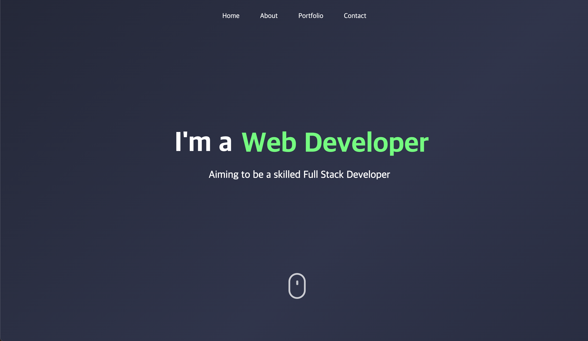

# Personal Website

• [Visit the website here](https://junbeomwooo.github.io/)

   
## Introduction
I have created a personal portfolio website with responsibe features for mobile, tablet and computer.

You can find there information about me including short introduction, my skills, academic credentials, and contact information.

Moreover, in the portfolio section you can find imaginary online store I created as a personal project.

   
## Development Environment
• Client : HTML, React, Styled-components

• Deployment environment : Github

• Design : Adobe Illustrator, Adobe Photoshop

   
